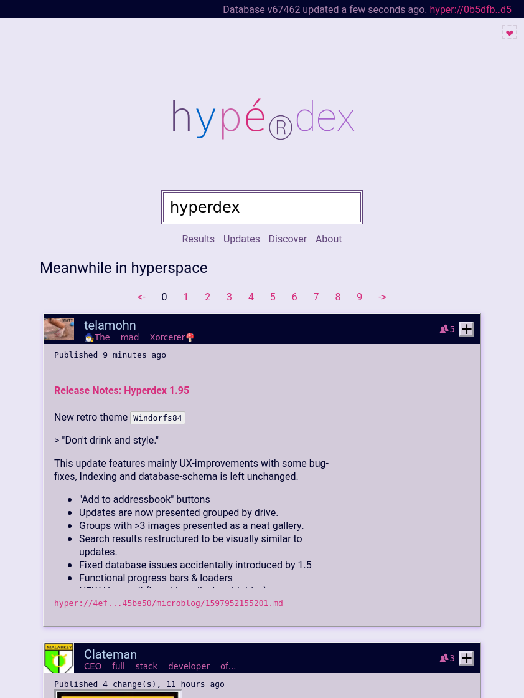

# 📘 hyperdex

> hyperspace search engine

This is the webapp component that performs local lookups in the distributed index
generated by the friendly [spider robot](https://github.com/telamon/hyperspace-indexer).



## Use

[Get beaker](https://beakerbrowser.com/) then visit:

[hyper://cb8986b2d773e17eaa665c1c3d250757348945ba73bf8f95d3b209b92c307e3a/](hyper://cb8986b2d773e17eaa665c1c3d250757348945ba73bf8f95d3b209b92c307e3a/)

## Development

```bash
yarn && yarn serve
```

Then visit [http://localhost:5000](http://localhost:5000) using the beaker browser.

## Release

I've written a script that manages a distribution drive
in folder `.hyper_dist/` and conditionally imports only files whose
content truly is different (using md5 hashes metadata)

Releasing a page from build to hyperspace has never been easier:

```bash
yarn build && yarn release
```
Example output:

```bash
Imported 869fad781a55f42a744381814e2955ef build/bundle.css
Imported f184b695cecf669ad1126295dc4c72ae build/bundle.css.map
Imported d16a09e1f126b2ddc971dcbf5d972bb7 build/bundle.js
Imported 3d8b0ef8bb73b917e165e24437daa886 build/bundle.js.map
hyper://cb8986b2d773e17eaa665c1c3d250757348945ba73bf8f95d3b209b92c307e3a @ 15
```

Visit the `hyper://`-URL in beaker then add to addressbook + host and
your local hyper-drive daemon will keep a read-only copy of your
distribution drive.

Need to switch computers for publishing? No prob, just zip + transfer
the `.hyper_dist/` folder to destination. (but make sure to delete it at the source to avoid tree-corruption)

## Donations

```ad
 _____                      _   _           _
|  __ \   Help Wanted!     | | | |         | |
| |  | | ___  ___ ___ _ __ | |_| |     __ _| |__  ___   ___  ___
| |  | |/ _ \/ __/ _ \ '_ \| __| |    / _` | '_ \/ __| / __|/ _ \
| |__| |  __/ (_|  __/ | | | |_| |___| (_| | |_) \__ \_\__ \  __/
|_____/ \___|\___\___|_| |_|\__|______\__,_|_.__/|___(_)___/\___|

If you're reading this it means that the docs are missing or in a bad state.

Writing and maintaining friendly and useful documentation takes
effort and time. In order to do faster releases
I will from now on provide documentation relational to project activity.

  __How_to_Help____________________________________.
 |                                                 |
 |  - Open an issue if you have ANY questions! :)  |
 |  - Star this repo if you found it interesting   |
 |  - Fork off & help document <3                  |
 |.________________________________________________|

I publish all of my work as Libre software and will continue to do so,
drop me a penny at Patreon to help fund experiments like these.

Patreon: https://www.patreon.com/decentlabs
Discord: https://discord.gg/K5XjmZx
Telegram: https://t.me/decentlabs_se
```


## Changelog

### 1.95.0

New retro theme `Windorfs84`

> "Don't drink and style."

This update features mainly UX-improvements with some bug-fixes,
Indexing and database-schema is left unchanged.

- "Add to addressbook" buttons
- Updates are now presented grouped by drive.
- Groups with >3 images presented as a neat gallery.
- Search results restructured to be visually similar to updates.
- Fixed database issues accidentally introduced by 1.5
- Functional progress bars & loaders

Migrating to new url, other drive got borked:

hyper://cb8986b2d773e17eaa665c1c3d250757348945ba73bf8f95d3b209b92c307e3a/

### 1.5.0

- Improved search index density, total db size is now ~38MB vs ~300MB
- Improved updates, now with content previews
- Refactored reactive stores to conditionally fire on update (perf upgrade)
- Made absence of styles even more obvious.

### 0.1.0 first release

## Contributing

By making a pull request, you agree to release your modifications under
the license stated in the next section.

Only changesets by human contributors will be accepted.

## License

[AGPL-3.0-or-later](./LICENSE)

2020 &#x1f12f; Decent Labs AB - Tony Ivanov
